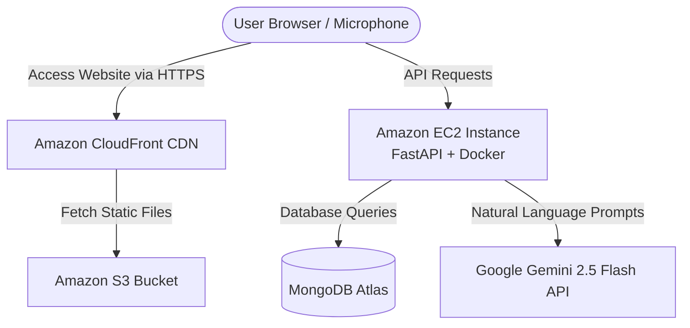

# VoiceCart: Voice Command Shopping Assistant

VoiceCart is a modern, full-stack, voice-first web application that allows users to manage their shopping lists using natural language. It features a sleek glassmorphic React frontend and a powerful AI-driven FastAPI backend.

## 🚀 Architecture overview

This project utilizes a decoupled, cloud-native architecture:
- **Frontend**: React + Vite (Hosted on Amazon S3 + CloudFront CDN)
- **Backend**: FastAPI + Python + Docker (Hosted on Amazon EC2)
- **Database**: MongoDB (Hosted on MongoDB Atlas)
- **AI/NLP**: Google Gemini 2.5 Flash via the `google-genai` SDK



## ✨ Key Features
- **Multilingual Voice Input**: Uses the Web Speech API for real-time transcription. Supports English, Spanish, French, Hindi, and more.
- **AI-Powered NLP**: The backend leverages Gemini 2.5 Flash to intelligently extract complex intents (`ADD`, `REMOVE`, `SEARCH`, `UPDATE`) and parameters (quantities, items, price limits) from natural voice commands.
- **Offline Fallback**: Includes a robust rule-based fallback NLP parser if the AI API is unavailable.
- **Recipe Generation**: Ask the AI to generate a recipe based on the items currently in your shopping cart!
- **Premium UI**: Built with Vanilla CSS, featuring dark-mode glassmorphism, micro-animations, and dynamic visual pulsing during voice capture.

## 🛠️ Local Development Setup

### 1. Database
Ensure you have MongoDB running locally on `mongodb://localhost:27017` or update the `MONGO_URI` environment variable.

### 2. Backend (FastAPI)
```bash
cd backend
python -m venv venv
# Windows: venv\Scripts\activate
# Mac/Linux: source venv/bin/activate

pip install -r requirements.txt
```
Create a `backend/.env` file with your Gemini API key:
```env
GEMINI_API_KEY="your_api_key_here"
MONGO_URI="mongodb://localhost:27017"
```
Run the backend:
```bash
uvicorn main:app --reload --host 127.0.0.1 --port 8000
```

### 3. Frontend (React/Vite)
Open a new terminal in the project root:
```bash
npm install
npm run dev
```

## ☁️ AWS Free-Tier Deployment

This application is optimized for a $0/month AWS deployment.

1. **Database**: Spin up a free M0 cluster on **MongoDB Atlas** and get your connection string.
2. **Backend (Amazon EC2)**:
   - Launch a `t2.micro` EC2 instance (Ubuntu).
   - SSH in and clone the repository.
   - Build and run the Docker container:
     ```bash
     cd backend
     docker build -t voice-backend .
     docker run -d -p 8000:8000 -e MONGO_URI="..." -e GEMINI_API_KEY="..." voice-backend
     ```
3. **Frontend (Amazon S3 + CloudFront)**:
   - Update `.env.production` with your EC2 IP: `VITE_API_URL=http:/54.173.104.41:8000/api`
   - Build the app: `npm run build`
   - Upload the `dist/` folder to an S3 bucket configured for static website hosting.
   - Put a **CloudFront Distribution** in front of the S3 bucket to provide a free SSL/HTTPS certificate (required for microphone access in modern browsers).
   - *Note: You must allow Insecure Content in Chrome Site Settings for the CloudFront URL to allow the HTTPS frontend to talk to the HTTP EC2 backend.*
   - final running app : https://d2vpm2l0ledui3.cloudfront.net/

## 📂 Project Structure

```text
voice_process/
├── backend/                # FastAPI Backend Service
│   ├── main.py             # Main application and API routes
│   ├── Dockerfile          # Container definition
│   ├── requirements.txt    # Python dependencies
│   └── .env                # Backend environment variables
├── src/                    # React Frontend App
│   ├── components/         # UI Components (ShoppingList, SearchResults, etc.)
│   ├── services/           # API and NLP services (apiService.js, nlpService.js)
│   ├── App.jsx             # Main application layout and state
│   └── main.jsx            # React entry point
├── public/                 # Static assets
└── .env.production         # Frontend build environment variables
```

## 📡 API Reference

The backend exposes a fully functional REST API.

| Method | Endpoint | Description |
| :--- | :--- | :--- |
| `POST` | `/api/process-command` | Sends a voice transcript to Gemini AI and returns a parsed JSON intent. |
| `GET` | `/api/items` | Retrieves all items currently in the shopping list. |
| `POST` | `/api/items` | Adds a new item to the shopping list database. |
| `PUT` | `/api/items/{id}` | Updates the quantity of a specific item. |
| `DELETE` | `/api/items/{id}` | Removes a specific item from the list. |
| `DELETE` | `/api/items` | Clears the entire list and moves items to history. |
| `POST` | `/api/recipe` | Sends current items to Gemini AI to generate a recipe and missing ingredients. |

## 🔮 Future Roadmap
- [ ] **User Authentication**: Implement JWT based authentication to allow multiple users to save personal lists.
- [ ] **Native Mobile App**: Wrap the application using React Native or Capacitor for native iOS/Android microphone handling.
- [ ] **Automated CI/CD**: Add GitHub actions to automatically build the Docker container and push the frontend to S3 on commit.
